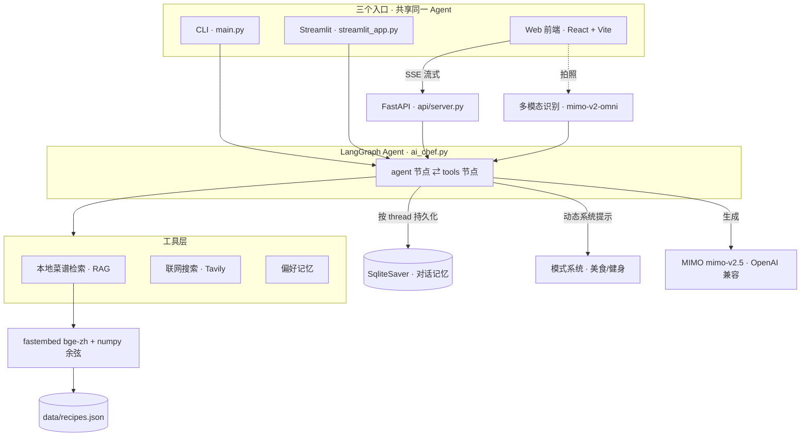

# 🍳 AI 私人厨师 · AI Personal Chef

> 一个**可迁移到任意垂直领域的大模型应用框架**——以"私人厨师"为载体，完整实现了
> **Agent 工具编排、RAG 检索、多模态识别、长期对话记忆、可扩展模式系统**。
> 把通用大模型「落地」成一个有记忆、有人设、能动手的产品，而非简单套壳调 API。

聊天问菜谱只是表层；底层是一套**行业大模型落地的标准范式**（RAG + Agent + 记忆 + 多模态 + 垂直化），
可平移到金融问答、政务知识库、企业 Copilot 等任意场景。

---

## ✨ 核心亮点

| 能力 | 实现 |
|---|---|
| 🧠 **Agent + 工具编排** | 基于 **LangGraph** 的 `agent ⇄ tools` 循环，模型自主决定何时检索/记忆 |
| 📚 **从零实现 RAG** | 本地 `bge-small-zh` 向量化 + **numpy 余弦相似度**检索本地菜谱库（不依赖向量数据库黑箱） |
| 👁️ **多模态识别** | 拍冰箱照片 → `mimo-v2-omni` 识别食材 → 自动推荐（感知与推理解耦） |
| 💾 **长期对话记忆** | LangGraph **SqliteSaver checkpointer**，按会话线程持久化，前端只发增量 |
| 🎭 **可扩展模式系统** | 美食 / 健身模式（注册表/策略模式），切换即换人设，且**按对话隔离**互不串味 |
| 🏋️ **循证业务计算** | 健身宏量用 Mifflin-St Jeor + 能量平衡推算，**有依据非拍脑袋** |
| ⚡ **真·Token 级流式** | FastAPI **SSE** + LangGraph `messages` 流，逐字输出 |
| 🧩 **结构化卡片渲染** | 大模型输出结构化 JSON → 前端渲染成菜谱卡 / 周计划课表（含流式占位与容错解析） |

---

## 🏗️ 系统架构



---

## 🧩 功能一览

- 💬 **流式对话推荐**：根据食材/需求推荐菜谱，逐字流式输出
- 📷 **拍照识别食材**：上传冰箱照片，自动识别食材并推荐
- 📚 **本地菜谱知识库**：语义检索（"番茄鸡蛋"也能召回"西红柿炒蛋"）
- 🛒 **购物清单**：从收藏/周计划一键聚合食材
- 📅 **一周食谱**：早 / 午 / 晚三餐课表式周计划
- 🎭 **模式切换**：美食模式（讲风味）/ 健身模式（按营养目标）
- 🏋️ **健身档案 + 每日目标**：身高体重目标 → 算出每日热量/蛋白/碳水/脂肪
- 📊 **今日饮食记录**：记录摄入，进度条对比每日目标
- ❤️ **偏好记忆**：说一次"不吃香菜""对花生过敏"，之后推荐自动避开

> 📸 截图占位（建议补上）：`docs/screenshots/` —— 聊天流式、菜谱卡、周计划课表、健身进度、拍照识别

---

## 🛠️ 技术栈

**后端 / AI**
- Python 3.11、**FastAPI**（SSE 流式）
- **LangGraph**（Agent 编排 + checkpointer 记忆）、LangChain
- **MIMO**（小米）大模型：`mimo-v2.5`（对话）/ `mimo-v2-omni`（多模态），OpenAI 兼容
- **fastembed** + `BAAI/bge-small-zh-v1.5` 向量化、**numpy** 余弦检索
- **SQLite**（偏好 / 健身档案 / 模式 / 饮食记录 / 对话记忆）
- Tavily（联网搜索）

**前端**
- **React 19 + TypeScript + Vite**
- **Zustand**（状态 + 持久化）、**Tailwind CSS v4**
- react-markdown、lucide-react

---

## 🚀 快速开始

### 1. 后端

```bash
# 安装依赖（使用 uv）
uv sync

# 配置环境变量：项目根目录新建 .env
#   MIMO_API_KEY=你的密钥
#   MIMO_BASE_URL=https://token-plan-cn.xiaomimimo.com/v1
#   TAVILY_API_KEY=你的密钥   # 联网搜索可选

# 启动 API（供前端调用）
uvicorn api.server:app --reload --port 8000
```

也可单独体验另外两个入口：

```bash
python main.py                 # 命令行版
streamlit run streamlit_app.py # Streamlit 版
```

### 2. 前端

```bash
cd frontend
npm install
npm run dev        # 打开 http://localhost:5173
```

> 前端通过 Vite 代理把 `/api` 转发到后端 `:8000`，本地直接联调。

---

## 📂 项目结构

```
app/
├── agents/ai_chef.py   # LangGraph Agent：图定义 / 工具 / 流式 / 系统提示
├── recipe_rag.py       # RAG：embedding + numpy 余弦检索 + 向量缓存
├── vision.py           # 多模态：照片 → 食材识别
├── modes.py            # 模式注册表（美食/健身）
├── fitness.py          # 健身档案 + 每日宏量目标（循证计算）
├── food_log.py         # 今日饮食记录 + 进度
├── preferences.py      # 偏好记忆
└── recipe_text.py      # 菜谱 JSON → 可读文本（CLI/Streamlit 用）
api/server.py           # FastAPI：/api/chat(SSE) 及各业务接口
data/recipes.json       # 本地菜谱知识库
frontend/               # React + TS 前端
main.py                 # CLI 入口
streamlit_app.py        # Streamlit 入口
```

---

## 💡 技术亮点（面试可深入）

- **从零实现 RAG**：归一化向量后用一次矩阵乘法做余弦相似度取 top-k，看得见检索的全部数学；针对国内网络做了模型离线缓存加固，并在检索失败时优雅回退联网搜索。
- **LangGraph 对话记忆**：用 `add_messages` reducer + SqliteSaver checkpointer，按 `thread_id` 持久化整段对话，前端每轮只发增量、历史由后端恢复。
- **模式按对话隔离**：定位并修复了"切换模式后行为串味"的问题——根因是**对话历史压过系统提示**，方案是模式随请求注入 + 每对话独立线程。
- **多模态"感知前置"**：把图像识别拆成独立步骤（omni 模型识别食材 → 转文本 → 主 Agent 推理），让感知与推理解耦、互不影响。
- **解析健壮性**：花括号匹配 + 按形状分派 + JSON 容错修复 + 流式未完成占位，保证大模型的结构化输出稳定渲染成卡片。

---

## 🗺️ Roadmap

- [ ] 单元测试（pytest / vitest）与 CI
- [ ] Docker 部署 + 在线 Demo
- [ ] RAG / Agent 效果评估（检索召回率、LLM-as-judge）
- [ ] 多用户与鉴权

---

> 本项目用于学习与作品展示。大模型与 embedding 走 API/本地推理，密钥仅存于服务端 `.env`。
